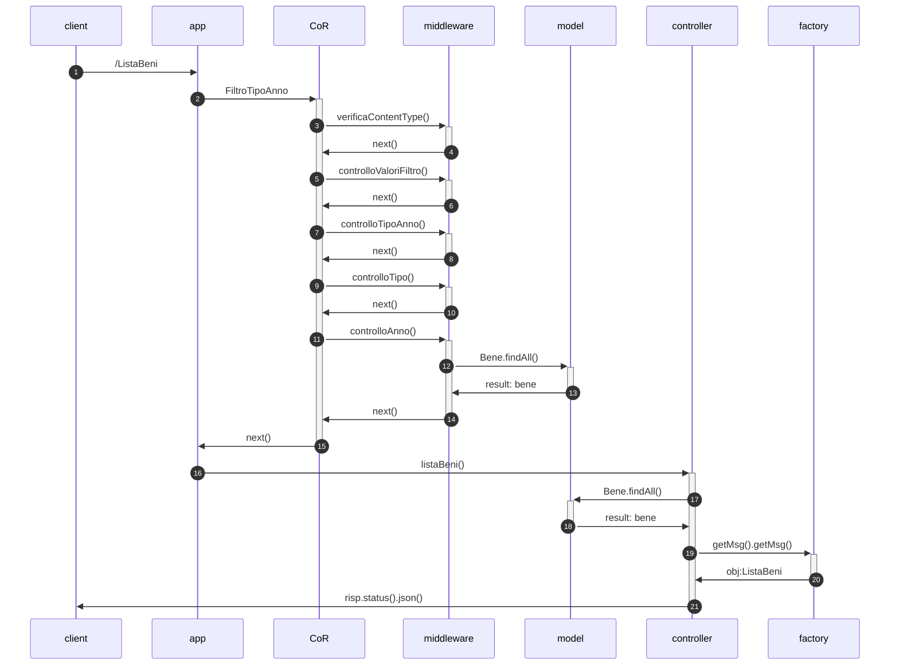

# Battleship  (Progetto PA)
## Descrizione del progetto
backend
 
## Funzioni del sistema
<table align="center">
    <thead>
        <tr>
            <th>Token</th>
            <th>Funzioni</th>
            <th>Ruolo</th>
        </tr>
    </thead>
    <tbody>
        <tr>
            <td rowspan=6>senza token</td>
            <td>Refill di un user con un certo credito</td>
         <td>general</td>
        </tr>
        <tr>
            <td>Mostra il credito rimasto di un utente</td>
         <td>general</td>
        </tr>
        <tr>
            <td>Mostra lo stato di una partita</td>
         <td>general</td>
        </tr>
        <tr>
            <td>Mostra il log delle mosse di una data partita</td>
         <td>general</td>
        </tr>
        <tr>
            <td>Mostra il le statistiche di un dato utente</td>
         <td>general</td>
        </tr>
        <tr>
            <td>Mostra la classifica dei giocatori ordinata</td>
         <td>general</td>
        </tr>
      
        <tr>    
            <td rowspan=2>con token</td>
            <td>Effettuare l’acquisto di uno specifico bene </td>
         <td>user</td>
        </tr>
        <tr>
            <td>Scaricare il bene acquistato</td>
         <td>user</td>
        </tr>
     <tr>
    </tbody>
</table>

Ogni funzione è associata ad una diversa richiesta HTTP (POST o GET), per alcune delle quali è prevista un'autenticazione tramite token JWT.

## Rotte
La seguente tabella mostra le richieste possibili:

<table align="center">
    <thead>
        <tr>
            <th>Tipo</th>
            <th>Rotta</th>
        </tr>
    </thead>
    <tbody>
        <tr>
         <td> GET </td>
         <td> /ListaBeni </td>
        </tr>
        <tr>
         <td> GET </td>
         <td> /Lista </td>
        </tr>
         <tr>
         <td> POST </td>
         <td> /AcquistaBene </td>
        </tr>
         <tr>
         <td> GET </td>
         <td> /download/:bene/:formato/:tipoDownload/:idAcquisto </td>
        </tr>
        <tr>
         <td> POST </td>
         <td> /NuovoLink </td>
        </tr>
         <tr>
         <td> GET </td>
         <td> /VediAcquisti </td>
        </tr>
         <tr>
         <td> POST </td>
         <td> /AcquistaMultiplo </td>
        </tr>
        <tr>
         <td> POST </td>
         <td> /Regalo </td>
        </tr>
        <tr>
         <td> GET </td>
         <td> /VisualizzaCredito </td>
        </tr>
        <tr>
         <td> POST </td>
         <td> /Ricarica </td>
        </tr>
             <tr>
         <td> POST </td>
         <td> /AggiungiUtente </td>
        </tr>
    </tbody>
 </table>
 
 ### Visualizzazione dei beni (ListaBeni)
Mediante l'utilizzo di questa rotta si può visualizzare la lista di tutti i beni presenti. Questa rotta può essere richiamata da chiunque.

I filtri possono andare in AND, e si può filtrare per:
 - tipologia (manoscritti, cartografie storiche);
 - anno (relativo al bene di interesse storico).

Il payload deve essere inserito nel body della richiesta in formato JSON con la seguente struttura:

~~~
{
    "tipo":"manoscritto",
    "anno":355
}
~~~

### Sequence Diagram

#### Visualizzazione dei beni (ListaBeni)

