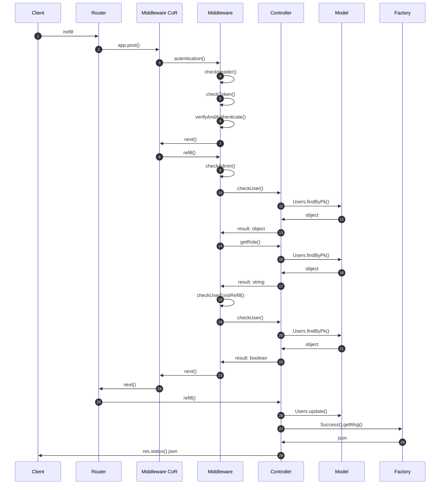
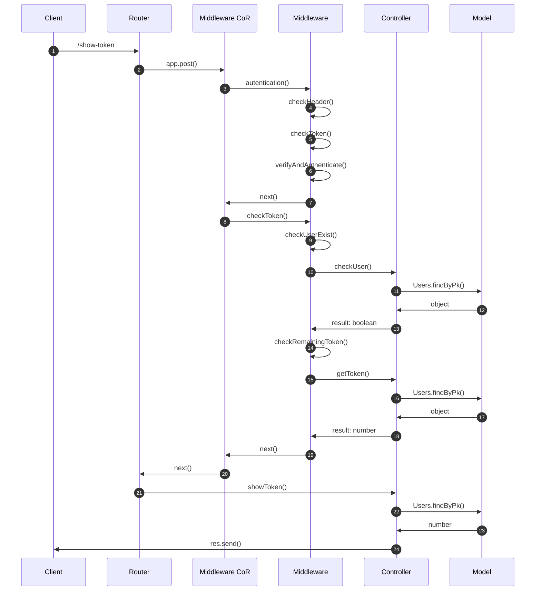
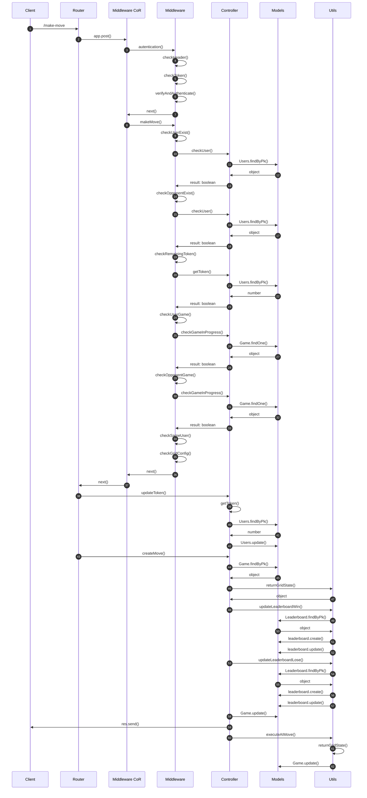
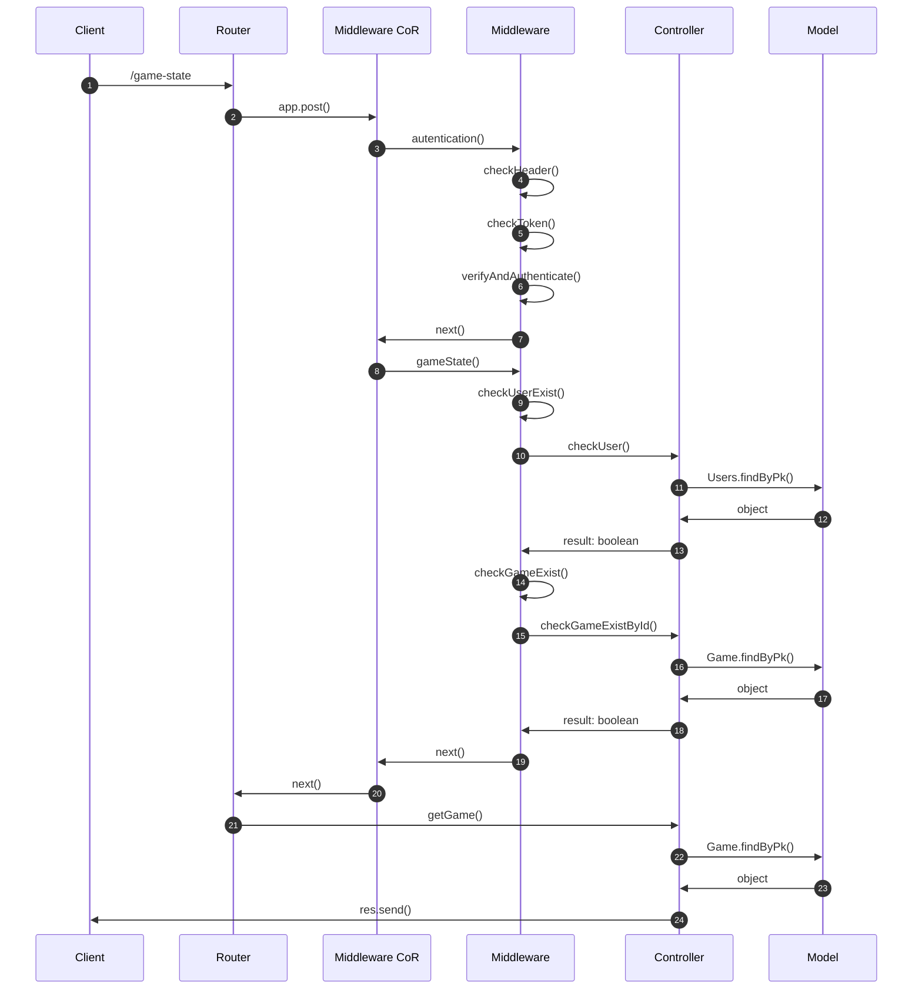
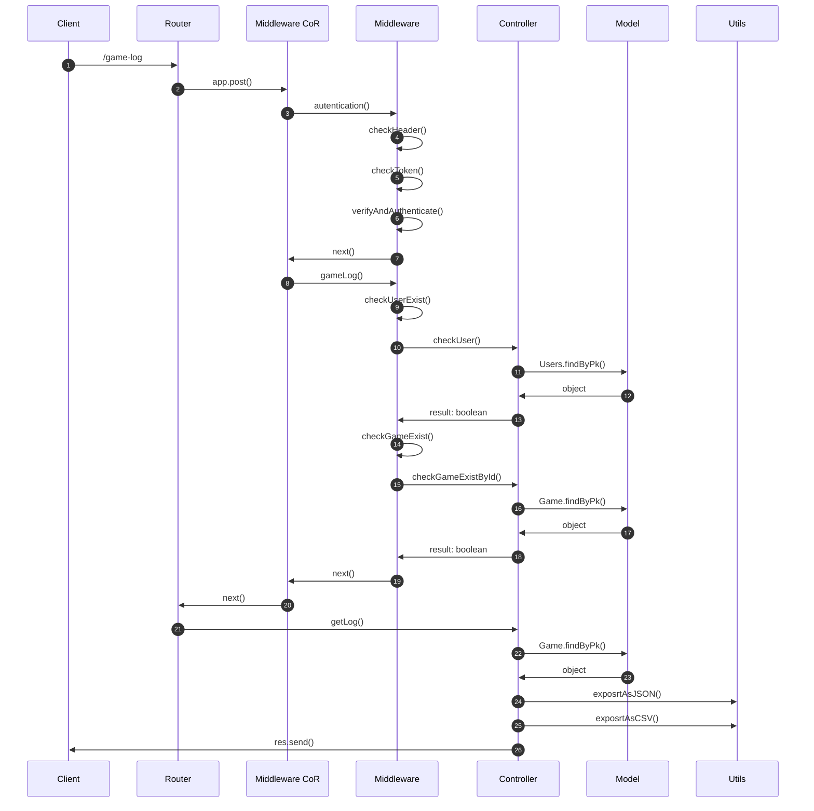
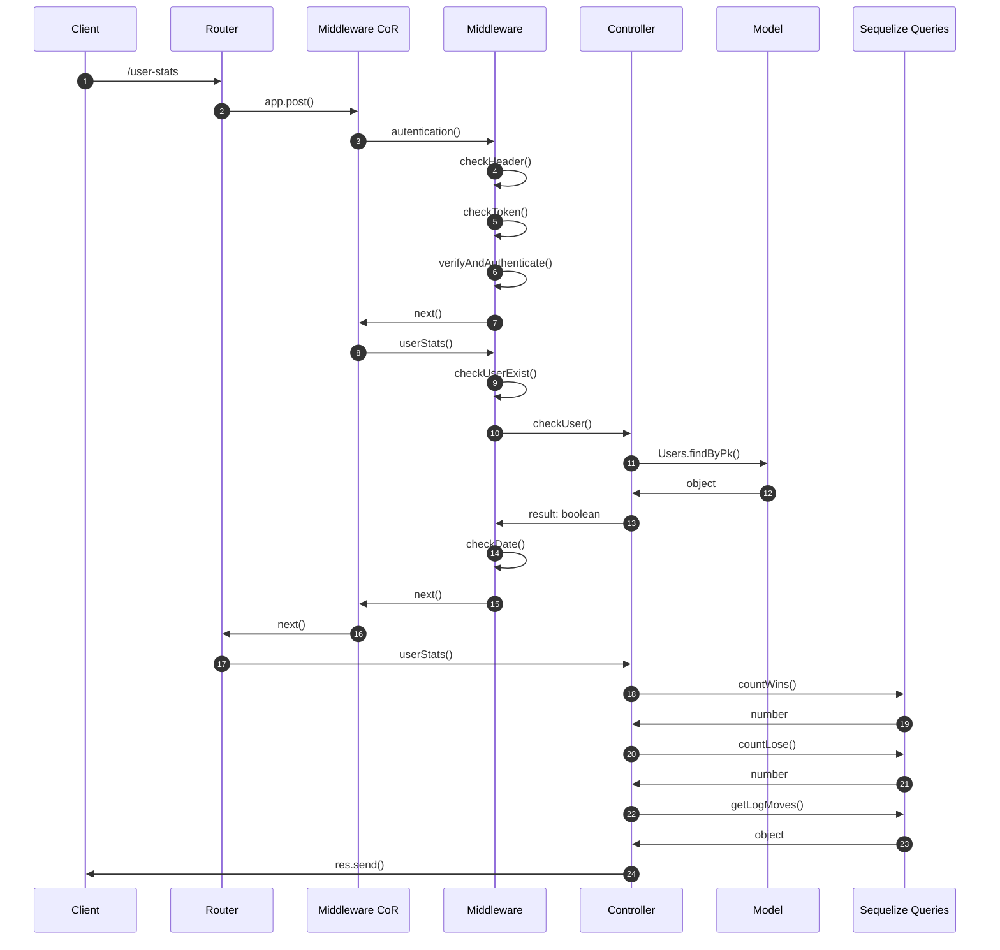
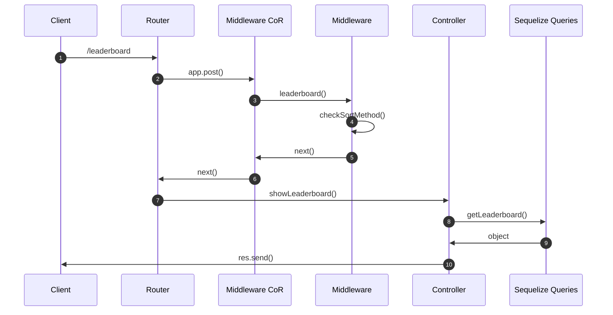

# Battleship backend
## Descrizione del progetto
Il progetto consiste in sistema di backend che consenta di gestire il gioco della battaglia navale. Il sistema prevede la possibilità di far interagire due utenti (autenticati mediante JWT) o un utente contro l’elaboratore. Alla creazione si possono scegliere tre configurazioni di griglie (5x5, 8x8, 10x10) e diverse configurazioni sul numero delle navi da piazzare. L'allocazione delle navi è randomica. Inoltre, si possono vIsualizzare tutte le info relative ad una partita, comprese di statistiche e di classifica. La creazione di una partita e la singola mossa hanno un costo in termini di token, rispettivamente 0.4 e 0.01.

## Funzioni del sistema

| Funzioni | Ruolo |
| -------- | ----- |
| Ricarica il credito di un utente | Admin |
| Mostra il credito rimasto di un utente | User |
| Crea una nuova partita | User |
| Esegui una mossa | User |
| Mostra lo stato di una partita | User |
| Mostra il log delle mosse di una data partita | User |
| Mostra le statistiche di un dato utente | User |
| Mostra la classifica dei giocatori ordinata | General |

Ogni funzione è associata ad una diversa richiesta HTTP (POST o GET), per alcune delle quali è prevista un'autenticazione tramite token JWT.

## Rotte

| Tipo | Rotte |
| ---- | ----- |
| POST | /refill |
| POST | /show-token |
| POST | /begin-match |
| POST | /make-move |
| GET | /game-state |
| GET | /game-log |
| GET | /user-stats |
| GET | /leaderboard |

## Progettazione

### Use Case Diagram

### Interaction Overview Diagram

 
## Ricarica il credito di un utente (/refill)
Mediante l'utilizzo di questa rotta si può settare il credito di un utente. Questa rotta può essere richiamata solamente dagli utenti autenticati, con ruolo admin.

Da effettuare tramite token JWT che deve contenere un payload JSON con la seguente struttura:
~~~
{
    "email": "user2@mail.it",
    "token": 50
}
~~~

### Sequence Diagram di /refill

## Mostra credito di un utente (/show-token)
Mediante l'utilizzo di questa rotta si può visualizzare il credito di un utente. Questa rotta può essere richiamata dagli utenti autenticati.

Da effettuare tramite token JWT

### Sequence Diagram di /show-token

## Crea una nuova partita (/begin-match)
Mediante l'utilizzo di questa rotta si può creare una nuova partita. Questa rotta può essere richiamata solamente dagli utenti autenticati.
L'utente autenticato con JWT può iniziare una partita specificando il nome del player 2. Quest'ultimo può essere o un utente o l'intelligenza artificiale (AI). Inoltre, si può scegliere la dimensione della griglia tra le seguenti configurazioni: 5x5, 8x8, 10x10. L'ultima scelta che si può fare alla creazione della partita è il numero di navi in shipsConfig. Infatti, a seconda della grandezza della griglia si portanno scegliere un numero limitato di navi. Ad esempio, se si sceglie la griglia 8x8, il numero massimo di navi sarà il seguente:
* N° max di navi da 4 caselle = 4;
* N° max di navi da 3 caselle = 4;
* N° max di navi da 2 caselle = 6;
* N° max di navi da 1 casella = 6.

Rotta da effettuare tramite token JWT che deve contenere un payload JSON con la seguente struttura:
* Match contro un utente con griglia 5x5
~~~
{
    "player2": "user2@mail.it",
    "gridDim": 5,
    "shipsConfig": {
        "A": 2,
        "B": 0,
        "C": 2,
        "D": 1
    },
    "shipDims": {
        "A": 4,
        "B": 3,
        "C": 2,
        "D": 1
    }
}
~~~
* Match contro l'intelligenza artificiale con griglia 10x10
~~~
{
    "player2": "AI",
    "gridDim": 10,
    "shipsConfig": {
        "A": 6,
        "B": 4,
        "C": 2,
        "D": 8
    },
    "shipDims": {
        "A": 4,
        "B": 3,
        "C": 2,
        "D": 1
    }
}
~~~

### Sequence Diagram di /begin-match

## Esegui una mossa (/make-move)
Mediante l'utilizzo di questa rotta si può effettuare una mossa. Questa rotta può essere richiamata solamente dagli utenti autenticati. 
L'utente autenticato tramite JWT deve semplicemente scegliere una riga (row) e una colonna (col) che saranno le due coordinate della cella in cui sparerà. L'id univoco della partita dovrà essere lo stesso della partita che sta giocando quell'utente.

La rotta si deve effettuare tramite token JWT che deve contenere un payload JSON con la seguente struttura:
~~~
{
    "id": 10,
    "move": {
        "player": "user1@mail.it",
        "row": 1,
        "col": 0
    }
}
~~~

### Sequence Diagram di /make-move

## Mostra lo stato di una partita (/game-state)
Mediante l'utilizzo di questa rotta si può vedere lo stato di una partita.
L'utente autenticato tramite JWT può vedere lo stato di una partita semplicemente inserendo l'id della partita in corso o terminata. Questa rotta può essere richiamata solamente dagli utenti autenticati.

Il payload JSON deve avere la seguente struttura:
~~~
{
    "id": 10
}
~~~

### Sequence Diagram di /game-state

## Mostra il log delle mosse di una data partita (/game-log)
Mediante l'utilizzo di questa rotta si può vedere il log di una data partita. Questa rotta può essere richiamata solamente dagli utenti autenticati. Inoltre, è data la possibilità di esportare il log delle mosse in formato JSON o CSV ed il relativo path dove verrà salvato il file.

Da effettuare tramite token JWT che deve contenere un payload JSON con la seguente struttura:
* Export in CSV
~~~
{
    "id": 10,
    "path": "C:/Users/git/Battleship",
    "format": "CSV"
}
~~~
* Export in JSON
~~~
{
    "id": 10,
    "path": "C:/Users/git/Battleship",
    "format": "JSON"
}
~~~

### Sequence Diagram di /game-log

## Mostra le statistiche di un dato utente (/user-stats)
Mediante l'utilizzo di questa rotta si possono vedere le statistiche di un dato giocatore nell'intervallo di date scelto nella richiesta. Questa rotta può essere richiamata solamente dagli utenti autenticati.

Rotta da effettuare tramite token JWT che deve contenere un payload JSON con la seguente struttura:
~~~
{
    "start_date": "10/06/2022", 
    "end_date": "10/12/2022"
}
~~~

### Sequence Diagram di /user-stats

## Mostra la classifica dei giocatori ordinata (/leaderboard)
Mediante l'utilizzo di questa rotta si può vedere la classifica ordinata in modo crescente o descrescente. Questa rotta può essere richiamata da chiunque.

Da effettuare con un payload JSON con la seguente struttura:
* Classifica decrescente
~~~
{
    "sort": "desc"
}
~~~
* Classifica crescente
~~~
{
    "sort": "asc"
}
~~~

### Sequence Diagram di /leaderboard

## Pattern utilizzati

### Factory Method
Il **factory method** è un pattern di progettazione creazionale che fornisce un’interfaccia per la creazione di oggetti in una superclasse, ma consente alle sottoclassi di modificare il tipo di oggetti che verranno creati.  
Nel nostro progetto utilizziamo questo pattern per la creazione dei messaggi relativi allo stato dell'operazione che si vuole compiere, se questa va a buon fine verrà segnalato un successo, altrimenti un errore.

### Singleton
Il **singleton** è un design pattern creazionale che ha lo scopo di garantire che di una determinata classe venga creata una e una sola istanza, e di fornire un punto di accesso globale a tale istanza.  
Nel nostro progetto lo utilizziamo per effettuare la connesione al database, in maniera tale che di essa vi sia una sola istanza così da non consumare inutilmente risorse computazionali.

### Chain Of Responsability & Middleware
La **catena di responsabilità** è un pattern comportamentale che consente di passare le richieste lungo una catena di gestori. Alla ricezione di una richiesta, ciascun handler decide di elaborare la richiesta o di passarla al successivo handler della catena.  
È molto simile ad un decoratore ma a differenza di quest’ultimo, la catena di responsabilità può essere interrotta.  
La Catena di Responsabilità è formata da degli handler (funzioni o metodi), che hanno lo scopo di verificare se quello che gli viene passato soddisfa o meno dei criteri. Se il criterio è soddisfatto, non si ritorna, come avveniva nel Proxy, ma si va avanti passando il controllo all’handler successivo.  
Le funzioni **middleware** sono funzioni che hanno accesso all'oggetto richiesta (req), all'oggetto risposta (res) e alla successiva funzione **middleware** nel ciclo richiesta-risposta dell'applicazione. La funzione **middleware** successiva è comunemente indicata da una variabile denominata next.  
Nel progetto utilizziamo la **catena di responsabilità** insieme al **middleware** per verificare che per ciascuna delle operazioni che si vogliono compiere siano rispettati tutti i requisiti, se così non fosse il **middleware** che non viene rispettato segnalerà l'errore opportuno.

## Come avviare il progetto
Per poter eseguire il progetto è necessario aver installato **Docker**.

Gli step sono i seguenti:
1. Clonare repository,
2. Avviare docker,
3. All'interno della cartella, digitare: *docker compose up* (Attendere che l'esecuzione sia completata),
4. Il programma è in esecuzione.

## Testing
Si può testare il progetto eseguendo una serie di test predefiniti, per fare ciò occorre importare all'interno di Postman la collection *Battleship.postman_collection* che si trova in questo repository.   
I token **JWT**, sono stati generati, utilizzando JWT.IO, tramite la chiave 'secretkey'.  
**Essendo il seed valorizzato solamente per gli utenti è suggerito seguire l'ordine delle chiamate così come sono ordinate nella collection.**  

## Autori
#### Agostinelli Luca
#### Sgrignuoli Piero
