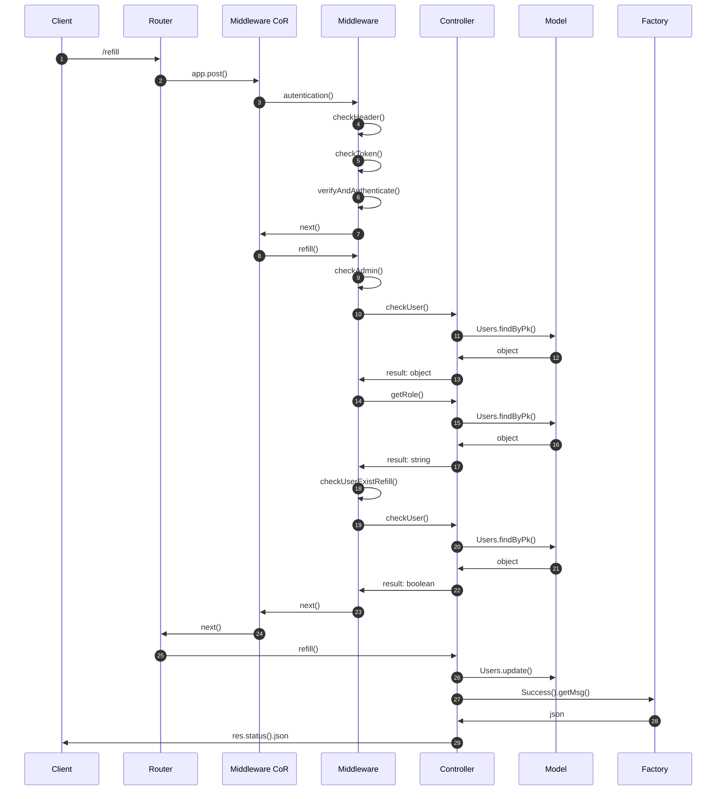
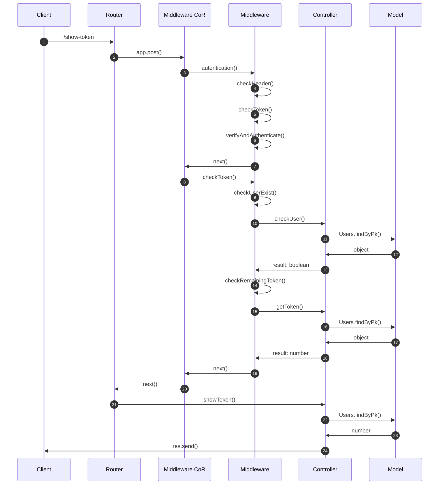
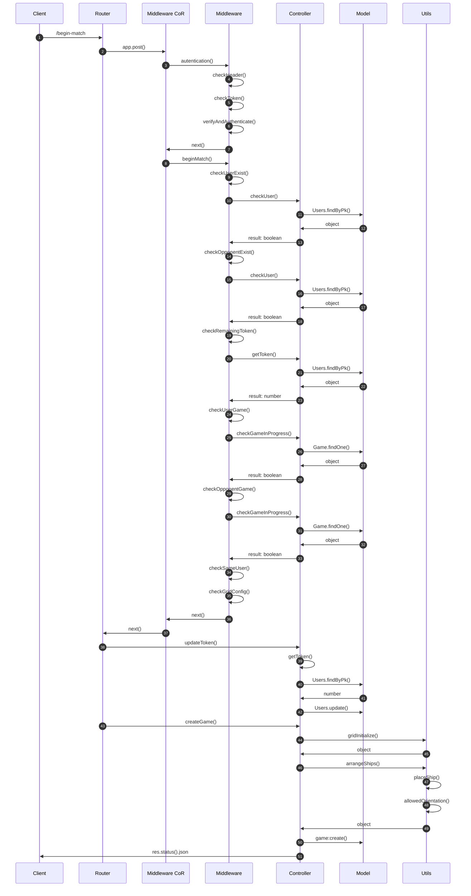
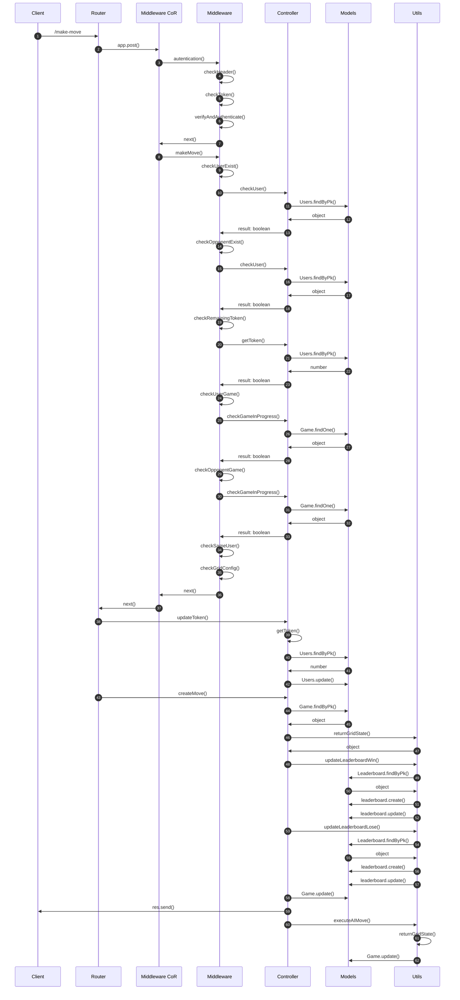

# Battleship backend
## Descrizione del progetto
Il progetto consiste in sistema di backend che consenta di gestire il gioco della battaglia navale. Il sistema prevede la possibilità di far interagire due utenti (autenticati mediante JWT) o un utente contro l’elaboratore. 

Sia la creazione di una partita e sia la mossa hanno un costo in termini di token.

## Funzioni del sistema

| Funzioni | Ruolo |
| -------- | ----- |
| Ricarica il credito di un utente | Admin |
| Mostra il credito rimasto di un utente | User |
| Crea una nuova partita | User |
| Esegui una mossa | User |
| Mostra lo stato di una partita | User |
| Mostra il log delle mosse di una data partita | User |
| Mostra le statistiche di un dato utente | User |
| Mostra la classifica dei giocatori ordinata | General |

Ogni funzione è associata ad una diversa richiesta HTTP (POST o GET), per alcune delle quali è prevista un'autenticazione tramite token JWT.

## Rotte

| Tipo | Rotte |
| ---- | ----- |
| POST | /refill |
| POST | /show-token |
| POST | /begin-match |
| POST | /make-move |
| GET | /game-state |
| GET | /game-log |
| GET | /user-stats |
| GET | /leaderboard |
 
## Ricarica il credito di un utente (/refill)
Mediante l'utilizzo di questa rotta si può settare il credito di un utente. Questa rotta può essere richiamata solamente dagli utenti autenticati, con ruolo admin.

Da effettuare tramite token JWT che deve contenere un payload JSON con la seguente struttura:

~~~
{
    "email": "user2@mail.it",
    "token": 50
}
~~~

### Sequence Diagram

## Mostra credito di un utente (/show-token)
Mediante l'utilizzo di questa rotta si può visualizzare il credito di un utente. Questa rotta può essere richiamata dagli utenti autenticati.

Da effettuare tramite token JWT

### Sequence Diagram

## Crea una nuova partita (/begin-match)
Mediante l'utilizzo di questa rotta si può creare una nuova partita. Questa rotta può essere richiamata solamente dagli utenti autenticati.

//possibilità di scelta

Da effettuare tramite token JWT che deve contenere un payload JSON con la seguente struttura:

~~~
{
    "player2": "user2@mail.it",
    "gridDim": 5,
    "shipsConfig": {
        "A": 0,
        "B": 0,
        "C": 0,
        "D": 1
    },
    "shipDims": {
        "A": 4,
        "B": 3,
        "C": 2,
        "D": 1
    }
}
~~~

### Sequence Diagram

## Esegui una mossa (/make-move)
Mediante l'utilizzo di questa rotta si può effettuare una mossa. Questa rotta può essere richiamata solamente dagli utenti autenticati.

//tutte le possibilità

Da effettuare tramite token JWT che deve contenere un payload JSON con la seguente struttura:

~~~
{
    "id": 32,
    "move": {
        "player": "admin@mail.it",
        "row": 1,
        "col": 0
    }
}
~~~

### Sequence Diagram

